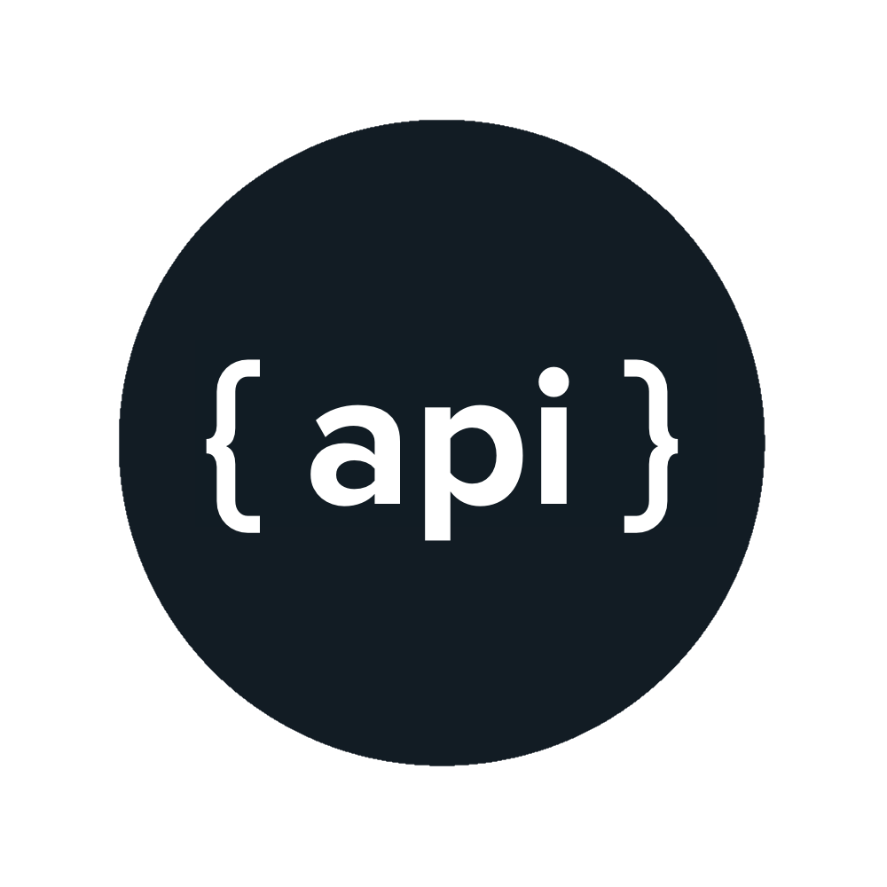

[npm](https://docs.npmjs.com/cli/install)

```bash
npm install alex --save
```

**alex** is also available as an AMD, CommonJS, and globals module, [uncompressed and compressed.](https://github.com/get-alex/alex/releases)

`alex(value[, allow])`

`alex.markdown(value[, allow])`

**Exemple**

```js
alex('We’ve confirmed his identity.').messages
```

**Yields:**

```js
[ { [1:17-1:20: `his` may be insensitive, use `their`, `theirs`, `them` instead]
    message: '`his` may be insensitive, use `their`, `theirs`, `them` instead',
    name: '1:17-1:20',
    reason: '`his` may be insensitive, use `their`, `theirs`, `them` instead',
    line: 1,
    column: 17,
    location: { start: [Object], end: [Object] },
    source: 'retext-equality',
    ruleId: 'her-him',
    fatal: false } ]
```

**Parameters**

- `value` (`VFile or string`) — Markdown or plain-text
- `allow` (`Array.<string>`, `optional`) — List of allowed rules

**Returns**
`VFile`. You’ll probably be interested in its `messages` property, as demonstrated in the example above, as it holds the possible violations.

---

`alex.html(value)`

Works just like `alex()` and `alex.text()`, but parses it as HTML. It will break your writing out of its HTML-wrapped tags and examine them.

**Exemple**

```js
alex('We’ve confirmed his identity.').messages
```

**Yields:**

```js
[ { [1:17-1:20: `his` may be insensitive, use `their`, `theirs`, `them` instead]
    message: '`his` may be insensitive, use `their`, `theirs`, `them` instead',
    name: '1:17-1:20',
    reason: '`his` may be insensitive, use `their`, `theirs`, `them` instead',
    line: 1,
    column: 17,
    location: { start: [Object], end: [Object] },
    source: 'retext-equality',
    ruleId: 'her-him',
    fatal: false } ]
```

---

`alex.text(value)`

Works just like `alex()`, but does not parse as markdown (thus things like code are not ignored)

**Exemple**

```js
alex('The `boogeyman`.').messages // => []

alex.text('The `boogeyman`.').messages
```

**Yields:**

```js
[ { [1:6-1:15: `boogeyman` may be insensitive, use `boogey` instead]
    message: '`boogeyman` may be insensitive, use `boogey` instead',
    name: '1:6-1:15',
    reason: '`boogeyman` may be insensitive, use `boogey` instead',
    line: 1,
    column: 6,
    location: Position { start: [Object], end: [Object] },
    source: 'retext-equality',
    ruleId: 'boogeyman-boogeywoman',
    fatal: false } ]
```
