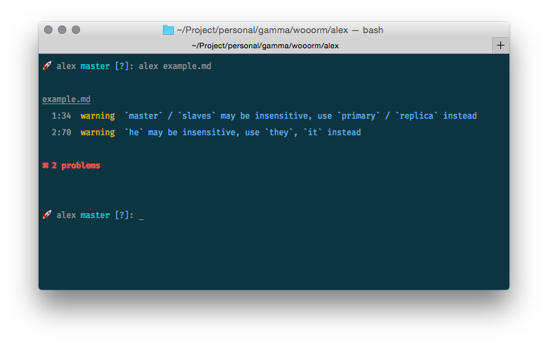

# 

>   📝 **alex** — Catch insensitive, inconsiderate writing.

[](https://travis-ci.org/wooorm/alex) [](https://codecov.io/github/wooorm/alex) [](https://codeclimate.com/github/wooorm/alex)

Whether your own or someone else’s writing, **alex** helps you find gender
favouring, polarising, binary thinking, identity insensitive, race related,
religion inconsiderate, or other **unequal** phrasing.

## Why

*   [x] Catches numerous different possible offenses;
*   [x] Suggests helpful alternatives;
*   [x] Reads plain-text and markdown as input;
*   [x] Stylish;
*   [x] Actively maintained;
*   [x] Feature requests and issues are more than welcome!

## Installation

[npm](https://docs.npmjs.com/cli/install):

```bash
npm install alex --global
```

## Command Line



Let’s say `example.md` looks as follows:

```markdown
All changes are written to the **master server**. The slaves are read-only
copies of master. When an _incoming message_ is given to the master, he
propagates through to the slaves.
```

Then, run **alex** on `example.md`:

```sh
alex example.md
```

Yields:

```text
example.md
  1:34  warning  `master` / `slaves` may be insensitive, use `primary` / `replica` instead
  2:70  warning  `he` may be insensitive, use `they`, `it` instead
```

See `alex --help` for more information.

## Programmatic

### alex(value)

**Example**

```js
alex('We’ve confirmed his identity.').messages;
/*
 * [ { [1:17-1:20: `his` may be insensitive, use `their`, `theirs` instead]
 *   name: '1:17-1:20',
 *   file: '',
 *   reason: '`his` may be insensitive, use `their`, `theirs` instead',
 *   line: 1,
 *   column: 17,
 *   fatal: false } ]
 */
```

**Parameters**

*   `value` ([`VFile`](https://github.com/wooorm/vfile) or `string`) —
    Markdown or plain-text.

**Returns**

[`VFile`](https://github.com/wooorm/vfile). You’ll probably be interested
in its [`messages`](https://github.com/wooorm/vfile#vfilemessages) property, as
demonstrated in the example above, as it holds the possible violations.

## License

[MIT](LICENSE) © [Titus Wormer](http://wooorm.com)
